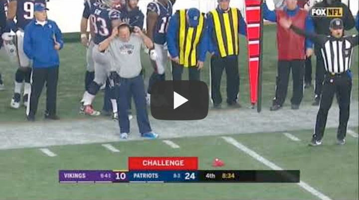

# In Doubt? Throw That Red Flag!

As I'm sure you already know, there's a fairly large number of people who have impersonated me, and there continue to be a large number of people who are impersonating my services/software, including [MineHQ](https://twitter.com/MineHQ) and [CheatBreaker](https://github.com/CheatBreaker/Security-Advisory).

In response to that, you can _throw the red flag_ and challenge anybody opening a server under my name or releasing software under my name or brands by using the process below.

If they can't respond to the challenge, then they're definitely not me, and they're probably not affiliated with me in any way, either.

## The Challenge Process

[](https://youtu.be/8JD-tYXLOfE "Challenge")

To verify that who you're talking to is actually me, feel free to challenge my identity at any time. The simplest way to do this is by sending me an identity challenge, which is a message containing random secrets of your choosing that you'll encrypt using my [PGP Public Key](README.md#PGP). You can see an unencrypted example of such a challenge below:

---

<details>
  <summary><strong>Example Challenge</strong></summary>

<pre>
I want to verify that you're actually jhalt. Therefore, I've encrypted this message using your public key.

I've chosen a random secret that only you'll be able to reveal by decrypting this message with your access card's private key.

The random secret is simply three randomly generated UUIDs, which I've saved locally so I can verify them later:
<strong>103b80cf-cc88-40ef-bd4c-a91436c6c98d</strong>
<strong>8e9cc5c4-9c75-4a7b-b672-46980d23332e</strong>
<strong>fa05200a-ea4c-45c6-95ae-b097e7fbc153</strong>

Because anyone impersonating you can simply send this message to you and then pass your response to them along to me, please make sure you only respond to this challenge from the following username/platform:
<strong>Telegram: @username</strong>

The current epoch time is <strong>1595307033</strong>. I understand that you won't reply to this message if there's too much time between the time this message was encrypted and the time you receive it.

I also understand that if there's malware on my computer at the time of me encrypting this message, it's possible a bad actor may already have the plaintext version of this message.
</pre>
</details>

---

## Sending a Challenge

If you're ready to challenge my identity, please follow the steps outlined below.

### Step 1. Preparing the Challenge

<sub></sub>

---

<details>
<summary><strong>Copy and Update the Challenge Template</strong></summary>

Copy the challenge template below to a notepad or text editor. The data that needs to be updated is in <strong>bold</strong> and is surrounded by asterisks. If you're not sure if you're doing it right, you can always compare your challenge to the "Example Challenge" above.
 
<pre>
I want to verify that you're actually jhalt. Therefore, I've encrypted this message using your public key.

I've chosen a random secret that only you'll be able to reveal by decrypting this message with your access card's private key.

The random secret is simply three randomly generated UUIDs, which I've saved locally so I can verify them later:
<strong>*insert <a href="https://onlinerandomtools.com/generate-random-uuid?count=3">3 Random UUIDs</a> here*</strong> // BE SURE TO SAVE THESE LOCALLY SO YOU CAN VERIFY THEM LATER!

Because anyone impersonating you can simply send this message to you and then pass your response to them along to me, please make sure you only respond to this challenge from the following username/platform:
<strong>*insert your username and platform here*</strong> // If the platform uses a discriminator (user#1234), be sure to include it!

The current epoch time is <strong>*insert <a href="https://www.epochconverter.com/">current epoch time</a>*</strong>. I understand that you won't reply to this message if there's too much time between the time this message was encrypted and the time you receive it.

I also understand that if there's malware on my computer at the time of me encrypting this message, it's possible a bad actor may already have the plaintext version of this message.
</pre>

</details>

---

<details>
<summary>Why do I need to specify secret data and save it locally?</summary>
<br>

Once you encrypt the secret data, it can only be decrypted by my private key. This means that somebody who is pretending to be me won't be able to tell you what the secrets are. I've chosen to use 3 UUIDs because they're simple and because there are a possible 2<sup>122</sup> UUIDs.

The reason you'd save them locally is so you can verify that the secrets I've decrypted are actually the ones you sent to me (thus, verifying my identity).

You can generate [3 Random UUIDs](https://onlinerandomtools.com/generate-random-uuid?count=3). Alternatively, you can use [random.org](https://random.org) for UUID generation, or you can provide any other sufficiently random piece of text.

</details>

---

<details>
<summary>Why do I need to specify my username and platform?</summary>
<br>

If you send a challenge to somebody who is pretending to be me, there would be nothing stopping them from taking your challenge and sending it to me. If that happened, I'd respond to them with the secrets, and they could respond to you with them. To avoid this, I'll only provide the decrypted secrets to the username on the platform provided here.

If this is a platform that uses a username discriminator (e.g. Test#1234), be sure to include your discriminator. If the platform uses a discriminator and you do not provide one, I will not provide you with the decrypted secrets.

</details>

---

<details>
<summary>Why do I need to provide the current epoch timestamp?</summary>
<br>

To ensure that messages aren't [replayed](https://en.wikipedia.org/wiki/Replay_attack), or that an impersonator doesn't make excuses as to why they cannot decrypt the message for a certain period of time:

 - I won't provide decrypted secrets for any message that isn't carrying a timestamp.
 - I may not respond if too much time has passed between the timestamp and the time I receive the message. (We're talking about several hours, not seconds or minutes)

</details>

---

### Step 2. Encrypt the Message

Now that you've updated all of the challenge data, you can encrypt it. Simply choose which option below best describes you:

---

<details><summary>I already know how to use PGP, just give me your public key.</summary>
<br>

Jeez, okay. You can find my public key [here](README.md#PGP). Just be sure to save your encrypted message as `challenge.txt` and send it to me on the respective platform. Alternatively, you can send me a link to a [Gist](https://gist.github.com/new) or [Hastebin](https://hastebin.com/).

</details>

---


<details><summary>I have no idea how to use PGP, help me!</summary>
<br>

You can [quickly encrypt your message](https://pgp.help/#/permalink?pgp=-----BEGIN%20PGP%20PUBLIC%20KEY%20BLOCK-----%0D%0AVersion%3A%20OpenPGP.js%20v1.5.7%0D%0AComment%3A%20https%3A~2F~2Fpgp.help%0D%0A%0D%0AxsFNBF8Uqx8BEACSD8ySF2X6aYD9DpnXF35lXS2wZ45xsQ~2F8rTvYFsaSIm1r%0AyxTPOG6s4YMapN~2FEiivyTaTYo%2Bu9QiOJDwRIUO%2BT%2BMnrS5dWL2rDIvvzYpBA%0AvQAzixfzHvFYv3xkdcCDoE7JylyS8AxCceWHKT7vfBXFtYWOCYZ~2Fxecduy2e%0AZm1EEXaVAlw8ZeTkv~2FGe%2B0Sm2aW5YHWBsl2uzpOe4Z%2B~2F5m1ZqWOgkfTE8zS6%0AYgY2z2alj4Na9wbO3aMY%2BHYIiUc0dIFQ0GrLOyEJNzTqItCp4Z%2B%2B317OLP%2Bv%0Ar3enenavR%2Bld0HQGnO9Kf4eOMI~2F%2BcIM7x8t1FY5fCSMShQL~2FX9D0quj4aSjd%0ArvLmCQq%2Bw3iXG~2F34tAteNYoq82emPcYKPVpGzP0XGwwBGxb70ks5bc1CcYl3%0AkuPZJ6YbAIpH1aNRMbVpG~2FmOBRyQVCunKynf0FgWb92cyD40I3nghbsE5uxE%0Aog11~2FPwKt6C4M0GmEdXoI0iy7CDfQdZ0I2bCl7pEpiKu4Qy56L2rdZgV~2FQt3%0A6yQpRwCxAy%2BqbeFBTnwCV1Ea1IyuMGqTNgAqB3NbGQ9NGnN9rFq6Ipjcu6hy%0AejUDF1LVL5rRFBZS5l8pylR%2BtRDiWOljCW15m9yl~2FKc0a7oA5Vjo3ywGXyXB%0A1PJ0DSoHRNK~2FbNUq0BAe95WvSWKP8okfszXZRQARAQABzSJKb25hdGhhbiBI%0AYWx0ZXJtYW4gPGpoYWx0QGhleS5jb20%2BwsGUBBMBCAA%2BFiEEegH6oeYVMzZM%0AskOqofVOh0vw%2BMwFAl8Uqx8CGwMFCQaXgAAFCwkIBwIGFQoJCAsCBBYCAwEC%0AHgECF4AACgkQofVOh0vw%2BMxQtQ~2F8CRy%2B8l7nWEbqVDcvWr4HuXHbtgz4rc9M%0ALQYy0aAugqQxwtZmKSJ8JCybrjR4W3H8j4lOYXlXMFcH4eowX7Ol5xRIAjeg%0AwoNRt0yK2KbAPjxR%2BoJ25Wl0jXvSMdK5N%2BIgz4uRvPIX2LdUUCCjFjvMDe9%2B%0AnciVu08DGsN82jzQNFfPE4IzGACPFxxvDEDMIba0jCTuFnBSeoKTJz1g6YGe%0A6~2Fsi3JGi0ce9DwiZLHdd5Ao0r41skHB8Mz6qFlMFd~2FbcArYMnuRrgI~2F5ZiuW%0A~2FTmLJq8%2BW~2FJn92EJgzDtfN5buKLpQfq9~2F4Zj%2BBgMfI5bB4maKjpATIL~2F3Lnu%0AkYHeYV79dH6RyTItLjuk5Ls8TbuF%2BzF3osHcZZ0CnwEc8bb9tiGyowiyabBu%0AWAO%2BUdGaeK1~2FTv3b7QDXxUpH2181dORQXKHW0cdPjwslzT7ChIWLi~2F9CbCVC%0AEvZRzCkTIuCzOvhKzmGJvq6J0nkx7KMnd52cGNVzrm~2FicSugsSP0pcxH1JXH%0Ai5ysWjcVbUJZeZcfMCuU4Ds2v0wBAP8iB3GW7n~2FOAHZRzA0PHQx~2F5haGrBbs%0Ayf78fzPhoecG6RECqJL1VMt~2FCQBaLhNja2xiQ0U%2B6QpydmMf0ndftmdwELcb%0AWyqepjTQ6xr~2Fenvne5C5OFxAplxBSY%2B5zOTUra0gfifcT6DJBFzOwU0EXxSr%0AHwEQAJxUpLimpGPCTNwX1v5EGZKcw4e%2Bd8nHCOKdChXEJYBIc2KPicTzRo~2FW%0AXqSRuQGh%2BXIVFmbZCEZq2Cl7JxQFI%2B%2B4l1kZvqT9CqJNG6RF0Nwhgp5CtuPQ%0AR%2B%2BKEmZ5~2F59TVlBWWfVyNJPtcVKHQhbtZWKNwXGCJcHvyQnmzLvCW1r0MRuy%0A%2BGkWEt2sLBSBfw7L8n~2FxeesMmJuhWrtGrPpqCWGFBesVFMTFxZhds8SipIE4%0AJDGmxKwXe1a0mh7KGJmxlIwnzZTNL6%2B5C1q4gl%2BzXEBxpc~2F4noDSSsmWJLTw%0ABOs53AQ%2BaCzzMS45OeuBXSobEjBntHOc6F2VqZyZSxCVkIJDq88FFp6pB~2F2k%0AXdDRgOIeGi7C0MMCNkKDNprouMiodPU8o6%2Bt24e9qU11LKcRCT9zTvA7G5Z6%0AuztotWQ1Z6%2BNoT393IYjkzo~2FwHzSkzuP4vcNN8cctDUOSPRI4lA6XWjej9vV%0A4Ic4pdBDEp~2FKEdebhJoG1J~2FdNZGYFnxBJjvfrYJcEHTqgqaTeG0mdw8BiMkV%0AeAMc~2Fkj3JGfLOpS2pOgW%2BxXXZI~2Ft0SXphzrduY9sTlaTkOErJluWSVj%2BH0jy%0AP4uKKbFpgwQ~2FIi17hyO%2BoUzECrrOmCk%2BXnWtLAyT29P7y77zNBKOfh1VWzIg%0AJW4bs1qWq~2F8C~2F98NjR7n4yAer9QlABEBAAHCwXwEGAEIACYWIQR6Afqh5hUz%0ANkyyQ6qh9U6HS~2FD4zAUCXxSrHwIbDAUJBpeAAAAKCRCh9U6HS~2FD4zPDFD~2F0V%0AZqlVmh~2FXtrhine5FootyKBiy6GB6RROJ%2BTF8JTaQfXiqyTBSBZSE7NlrSBa7%0A2aN72BtqgxXjL%2Bb6Fe48nWBuuO5ey98s%2BtleShco%2Bwj5RhEPDJG3KGWNJk9R%0AdcQZ5AXXJeMVY6FntyWBcMbgnKpUFkbS6tQBODVRP7uJh~2F7vH~2FLtpDw6UnP4%0Aq4g752AJKIbuo7yXoobiAyi8od9FOCVmvW146wnyE~2Fyuh3TMl%2BHL00aJpZyt%0AttJStXNWX3AluJ2rsCvhDi6LpFnpDB%2BH11kqbZT%2BDuu5V6jbpOl8%2BGzsQnfW%0AZa71F02yPE%2B2~2Fw%2Bs6L%2BXkqNsJkJ78xU~2Fhl%2BlZStbcuk%2B0ha2j9vLhhwuFMV3%0AdEn7hnvYF3sB3LdD3N%2BDGz6a3O1nRMdDRsTjrbLP074gZZ~2FoOuuvS3Ng7S0T%0AIjQ%2B5SnvR8E9PFvy8YkjlZM22pNZxZj95QEaTdVFRAw6uv3IHwCl0ciguByE%0AutD01%2BT0ucskwOjNu7JlYxSZrv3775B7GodMobaG0fnizEIC8YS3tA5i~2FNHf%0AOTvN2e9S227trZ9MuBxbbQI3EjquI5iP229Sx~2FVgvN%2B974RCViIHGxzPzHSr%0AzTFfHNl92gG17HcSlqgf0MUfbpCPJLeZyXt019Ecg8E%2Br3vLHALlIRo%2BWnue%0Ayda~2Fxv5UijGhaIfz7FTi887BTQRfFKtJARAAxIaGSnnf7soNBIG8WGl%2BI3T2%0AfCp8QnVx4aVtOCUZZVPabpNqdxmkVcieNMiG4U9EqMZESNuBEEN3c%2BUDatkk%0AZdv2IW8I~2Fu96JLaCrVuKEVbvFx5d9drrszAG~2Fz1DGati2Wl9wGuX9penXIzu%0AtvCvPNXLuBst5FiMN170wijvK3L6sPkw7qo3RE242S9vUKnQZJU0ks3Vz9nB%0AoxSea~2FEEVTb267uFeCcCFMCioP8n9C3dHdMK4j3nxReN2J8pgcgCq2jR47U8%0A9bolLwzxd1tCuADFF%2Bm1vGSjsN~2FUmzQrPkWkAxa9qPpA5FYggyF2L6BzV7cv%0AaS1nrHWj6nRjjBTcwZ4WfiXlmGdtnFQk6Db2w6EYzBHZ1RGmm2Vd42uQyHW2%0AoKoN41JR6e5fT%2BP4j8R9FzgnfBos0WUAb229Cevghf7JoJUAzJ%2BD2ePWe9pX%0AE4CFqUCLPXvi2L8rEsdO~2FBwF3av2CFtk6mNJ4f8YV%2BI%2BNnUPiJILUpxB2vBb%0AD4ZlHxDmQfJzc5m1Ucpo2KUBAlKREXGhH1xNBC2fpTyeVm%2BiuLjmtyBAZiy%2B%0AsECXPqB6LWAVREkPnCwyMGLjIhVcFT71rgKW28AevE0B~2FblesJTRJKIELlTS%0AN~2FlAyIS1B8pJze2Up7gzkufStGja8cF2uz3KBTupTEdmo9P7fk57Xqc3qdkA%0AEQEAAcLBfAQYAQgAJhYhBHoB%2BqHmFTM2TLJDqqH1TodL8PjMBQJfFKtJAhsg%0ABQkGl4AAAAoJEKH1TodL8PjMNT4P~2F2wEesNoXFPTmpnW%2BDefhuBw%2BdDLCoVh%0ApLdCeI21dznHR~2F0Ksd9vFnLpU46SpzaNAI7lEnHQY7SuJGM4Qcy9QGSO71g4%0A~2FeSV6Os%2Bs945jSvVdka1~2FfMiDsT~2F9lk1Oe%2Bz8abW9n9B8TvPdUVZqeR~2FTioe%0AeTBC~2FZXZwkGHjNnx6P8D9oxiX1dDZ52snQ4QcqA8wxQ1XfZyR3VVM%2Bo3DHMh%0ANuU6Cw5PngNlTNovpiVOprJ8j0ZDGJbnYpw%2Br9Il0ygCyX95PBcmC~2F9P72aN%0AQuhZWSZnuhG9Mj3eSOUlEdE51h~2FPKxZnF6~2Fvzw5O5tzzB6fCsgy5xnLPcyTq%0ACNBbytztd3mo2DMrVtLk1yn4B3sjXPdem9r1yZgYSQdNRfVt4BOqUlUuUhly%0A03MV7y%2BwQIgGLcR6a3UTF%2BL6YJEez7nAvPxnm%2BX%2BHattFi67lDmNzRFA4znX%0AoNOlfoID3XA1z7sesRYtQ7pGQkHLart7hWEw%2BoLNMxoVN4ASqQHXm~2FeDCJME%0AW7LNjD4z4F1NEmU~2Fb~2FQ%2BlL3VwI~2FiX5HXcu2Z59LyMfWAnOAecePAQWyDC5rf%0ASENoZAvW6Ws1kSbZoq~2FdX41CeyEI8erS58XkHSPJWGb0LpaCtJWYJDkL2UXI%0Ap%2B3~2Fbv~2F9VjJRPDoja6TemqlbDTsuaT4Vl9uzS6hOWOXSYPmbuAK6zsFNBF8U%0Aq28BEAC%2BQyrMp1KtwX%2BJa54XLdEoKxtL7lbNv9mVEvgnhugsYuV0dTNnPfXU%0A8gdGcvxcL3NFrzrKXCR%2BlFn%2B70a1Kafzp7IZ5L6ICPyoXguxUeDbmJ5AYJcR%0Af7pQNp0TE%2B08AOndXVt8GwRI7zNkteBGYj~2FaaGPIG%2Bzqkm~2FenRSsUcqHBYOi%0AD554CH%2BI75U8AXd2tEzz6qJEoE3dDZL7v6Zb93Nf8tOK9jN6c1W7jNXnHutd%0Al%2BNzuZxENOZEIsiaY2ZrwC5M92gq4XA7OlqRkxiZbrNKoAKRzUQBraO9Mi%2Bv%0ArcW9n04z6xDoGgpTSKzxApy2n04L3D4fw%2BvRUXEDl6mQ4vrsXvgwT%2B%2BJKtXT%0AW1VpQUn11k5mATrJJPIOpxxc8Zg6DiRroQhtMzbUMNn6oiVwya1uSX8DWnCw%0AXj%2Bnk29EcWM2iNFXJn%2BB3YF6IlZAL026998cQAQgls9hClZ5ZjIc~2F4%2B1tkhY%0ADXQ8klv9t6o6bS4stsZkHLHfVoDLfh4FPL7KyrxXVsrvAkiQt55XWl~2FDVEbD%0AP%2BrqXSAEB140VMlZ1OFdycobGK8uL7Xbm9lq4dbDxfVpRG4skF68ZcIN0zZL%0A7JBkE5QVazJaJpipMc7AjHwi4mzF%2BlC0532HFdVZaEZi6XhdfhwmDUqLN306%0Aa3cpbYFa%2B8%2BoC1N4fsQJ3YO3So~2FKXwARAQABwsOyBBgBCAAmFiEEegH6oeYV%0AMzZMskOqofVOh0vw%2BMwFAl8Uq28CGwIFCQaXgAACQAkQofVOh0vw%2BMzBdCAE%0AGQEIAB0WIQSD8trLbvRYqFKKw29DAokIAtlgMgUCXxSrbwAKCRBDAokIAtlg%0AMrr%2BD~2FwM3tvUwcsG~2F8aRCN%2Bak3vX7geWenKb4Q91qD%2B0k72Q4a89sI1MKNmc%0Agz99lUSHvTB3ZCaK4Ex3L1lU0KBJZ8UM57c8GVyfLLCE2HsOM3FsFbZG1xgw%0AapJ25wkcgLHkSoCfYbD%2B1epFHhs6EnhnLZLbrF9mPaKAe%2BMCgp3vLT7KlJep%0A8C91eZ~2F4x5oT7DtdtBuTfV72sXj6muBASV2uSsRR6ujskCaOawqa62eksdAr%0A1dFLuhiDw1kpsPp5rjCiV%2BpvUXn5EWrIJf7Kj6ZbcVxJUZJa703gxwcYgAUX%0ATpZEzDbK37FSjEtF~2F9epxSTGwIWE8nOzWp0GyRyN4~2F9pI6F8CQwI3B~2FUSGc8%0A0x91SZYBW9Unqo~2FbEtUIlglknOaO88nqMglxS3lSK3Kt%2By0BrHNK%2B~2FP1wvMP%0AkSc9VvbkwBrxY62ogN7O25BvoF7~2F0PjNhzMDu1H8HgS2y2ju9rIz1s1pTV6%2B%0AvR%2Bl7%2B2b2Y~2FG%2BBFt%2BlfGc8T0aUDzEEpWxAZD~2FMJi5e4dIGejK%2BYVrSAS5xCS%0A8xV~2FKehRGGIYe4xM5h%2BAZgUCxWAJERxS4osSL9NjBdvXpHFOhQysaLMC4rKf%0AgTqScIU8c149cxnO%2BxNC1g~2FhDTUtYoY8C1cpr2ZVEoD9vaQm37zoIJ0KjRNS%0AdzSc2P1Mjga4oGxs4DHTycYhtoc4Hd5bD~2F0XW4tDGqTvsLBL%2B%2BMIxXW5qEGS%0AI0T9Y%2Busnhw4DmR1IGPufyOj0LFTDIbGQKDFRaWVTGsNoGJoQg2L4RWgjmSE%0AAN%2Bz7FYd1mMncwrFWbF4OiQjS7snSRN7rHMGCb9v2aIyUKEdbklqXtLOLK3h%0AwJlfWbMiXatxBSvodBaU%2BTFGLGo08faAwJp7xGSfABoIjcnr6ts2kRlKkRBT%0AS33dIvfE2pq~2FF7XjhhcuKkM6KCziWJeEH7eqcaXSAXZsF1O1Cf%2BqfSIqg0O2%0AQ3ZgFr8qkH64U~2Fpzd9qnY6Df0%2BzxVmaB2usf7EiuqRw26Gx6Ko56ahoWiOMq%0AGMN2mwVOYMt~2F~2FPAa4uyWKGdC7EIymMmqvaBLnHq%2BeEWtkzmpok2pbyn9lFxs%0AlehPE7DOQqeFDVHsGS2bKA9mlDQP8MLG4rBQpA6QhwgBwxRhzwBms0CkKKtZ%0AK7hzmjySFeJzUOuD7Olrn5T84696dj5Y%2BvGNUhag99IbMLC07Bu1PPewaytq%0A2ko8eAk4oEyj7V~2Frjz6TxrhYBDjmQ2T1Ls00iqhOyZNcMGxIch5ZVb6P0%2BFE%0AGAOEsHF1Z3HgO~2F3GynAAX60QWV5x8O9DQBkiqpc894sRqZldO32v7Ol14R4Y%0AzuyhMn1x2Bq%2BKTk%2BOraBwBEfaW%2BTr5gajOehDkQRK4vcMa6LOFPuF1b0oQ%3D%3D%0D%0A%3DXaiU%0D%0A-----END%20PGP%20PUBLIC%20KEY%20BLOCK-----%0D%0A%0D%0A) using pgp.help (this link is set to encrypt data using my public key.)

**Please don't use this link for anything other than challenges.** If you are sending data that contains PII or other sensitive information, please properly configure PGP locally. **Before entering any text on pgp.help,** please verify that the source code contains the following header, which at the time of writing appears on line 12 and will ensure that your data is not transmitted over the internet:

```
<meta http-equiv="Content-Security-Policy" content="default-src 'none'; script-src 'self'; style-src 'self'; font-src 'self'; img-src 'self';">
```

Once you've verified this, simply copy the data from your notepad or text editor to the "**Message**" section. In the result section, you'll see something like this (but much larger):

```
-----BEGIN PGP MESSAGE-----
Version: OpenPGP.js v1.5.7
Comment: https://pgp.help

wcFMAywoH9voh9j9ARAAjKmuv64sF/uFyPmxgmEkR2Jaul/++22zJsyLxgOt
YsIJMaWwzAkHMasvfTQ0RwW1L3y+5DDhGVKOm9tWTUXqOBtyWcwa+9wGZCF/
y77n+k9/sYVVb
=o3ti
-----END PGP MESSAGE-----
```

Copy the result and save it as `challenge.txt`. Then, send me the challenge.txt file on the respective platform. Alternatively, you can send me a link to a [Gist](https://gist.github.com/new) or [Hastebin](https://hastebin.com/).

</details>

---

## Other Notes

If "I can't respond to the challenge" or for some other reason can't give you your secrets (except as specifically outlined above), you can be sure you're not actually talking to me.

I can promise you that neither the CheatBreaker client nor its source code are for sale. Anybody claiming to sell either of these is either scamming you, violating their non-disclosure agreements, or committing theft of trade secrets. In any case, your best bet is to save your money and not go down that rabbit-hole.

To be clear, it's still possible that an attacker could, in theory, retrieve your secrets without having access to my private key. If you're interested in how that may be, see the _"How!?!"_ section below:

---

<details><summary>How!?!</summary>
<br>

For example, one could attack the UUID generator website I've mentioned. That's possible, but unlikely, and there's not an extremely reliable way to figure out which secrets were actually used in your challenge.

An attacker could go after pgp.help, which would be much more useful than going after the UUID generator website. However, if you check the source code and verify that the Content-Security-Policy is intact, this _should_ stop most attacks. Even so, this attack is easily thwarted by using something such as [Gpg4win](https://www.gpg4win.org/) or another native implementation of PGP.

An attacker could have malware on your device, and would be able to see the data prior to encryption or see the secrets you saved. This is probably the most useful for an attacker, as they'd pick the data up prior to it having been encrypted.

Similarly, you might have some Minecraft "autoclicker", "hacked client", or even "anticheat" that is actually spying on your computer. If that's the case, they might be able to see the challenge before it's encrypted, or access your local filesystem to access the secrets you saved.

Alternatively, you could have attracted the attention of a nation-state... In which case, what the hell did you do?
</details>

---

<details>
<summary>pgp.help</summary>
<br>

pgp.help is a couple of years old, but it should be fine for a simple challenge use-case such as this.

Please don't use pgp.help for anything other than challenges, though. If you are sending data that contains PII or other sensitive information, please properly configure PGP locally. Before entering any text on pgp.help, please verify that the source code contains the following header, which at the time of writing appears on line 12 and will ensure that your data is not transmitted over the internet:

```
<meta http-equiv="Content-Security-Policy" content="default-src 'none'; script-src 'self'; style-src 'self'; font-src 'self'; img-src 'self';">
```

If you want your challenge to be more secure, then you can encrypt the challenge yourself using [my public key](README.md#PGP).

</details>

---

**In any case, this process is still extremely effective at snuffing out the idiots who are running Minecraft servers and clients pretending to be me.**